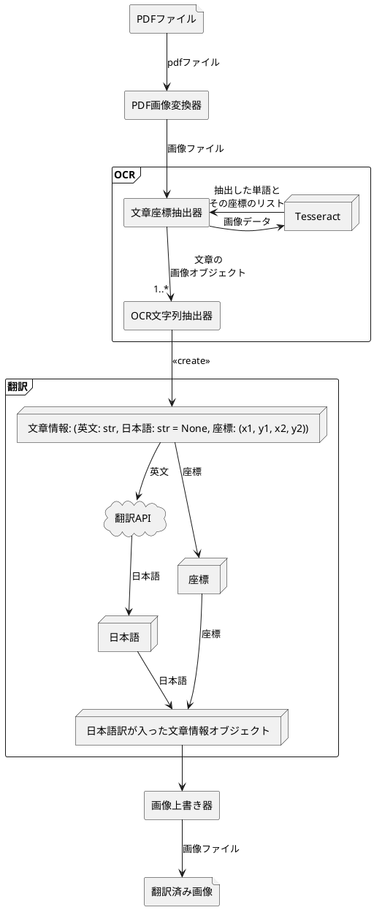
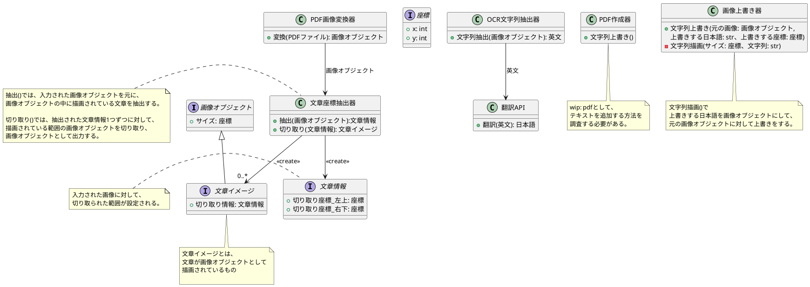

# システム構成図

```plantuml
@startuml

file PDFファイル as pdf
agent PDF画像変換器 as pdf_to_image
frame OCR{
agent 文章座標抽出器 as text_coordinate_extractor
node Tesseract as tesseract
agent OCR文字列抽出器 as ocr
}

frame 翻訳{
cloud 翻訳API as translator
node "文章情報: (英文: str, 日本語: str = None, 座標: (x1, y1, x2, y2))" as text_info
node 日本語 as japanese_str
node 座標 as pos
node "日本語訳が入った文章情報オブジェクト" as text_info_jp
}
agent 画像上書き器 as image_overwriter
file 翻訳済み画像 as end_node

pdf --> pdf_to_image: pdfファイル
pdf_to_image --> text_coordinate_extractor: 画像ファイル
tesseract -> text_coordinate_extractor : 抽出した単語と\nその座標のリスト
text_coordinate_extractor -> tesseract: 画像データ
text_coordinate_extractor -->"1..*" ocr: 文章の\n画像オブジェクト

text_info --> pos: 座標
pos --> text_info_jp: 座標
ocr --> text_info: <<create>>
text_info --> translator: 英文


translator --> japanese_str: 日本語
japanese_str --> text_info_jp: 日本語

text_info_jp --> image_overwriter
image_overwriter --> end_node: 画像ファイル

@enduml
```

```plantuml
@startuml

interface "画像オブジェクト" as image{
    + サイズ: 座標
}


class "PDF画像変換器" as pdf_to_image{
    + 変換(PDFファイル): 画像オブジェクト
}


class "文章座標抽出器" as text_coordinate_extractor{
    + 抽出(画像オブジェクト):文章情報
    + 切り取り(文章情報): 文章イメージ
}

note left
抽出()では、入力された画像オブジェクトを元に、
画像オブジェクトの中に描画されている文章を抽出する。

切り取り()では、抽出された文章情報1つずつに対して、
描画されている範囲の画像オブジェクトを切り取り、
画像オブジェクトとして出力する。
end note

pdf_to_image --> text_coordinate_extractor: 画像オブジェクト


interface "座標"{
    + x: int
    + y: int
}

interface "文章情報" as text_info{
    + 切り取り座標_左上: 座標
    + 切り取り座標_右下: 座標
}

note left
入力された画像に対して、
切り取られた範囲が設定される。
end note

text_coordinate_extractor --> text_info : <<create>>


interface "文章イメージ" as text implements image{
    + 切り取り情報: 文章情報
}

note bottom
文章イメージとは、
文章が画像オブジェクトとして
描画されているもの

end note

text_coordinate_extractor -->"0..*" text : <<create>>

class "OCR文字列抽出器" as ocr{
    + 文字列抽出(画像オブジェクト): 英文
}


class "翻訳API" as translator{
    + 翻訳(英文): 日本語
}

ocr --> translator: 英文

class "PDF作成器" as output_pdf{
    + 文字列上書き()
}


note bottom
wip: pdfとして、
テキストを追加する方法を
調査する必要がある。
end note


class "画像上書き器" as image_overwriter{
    + 文字列上書き(元の画像: 画像オブジェクト,
        上書きする日本語: str、上書きする座標: 座標)
    - 文字列描画(サイズ: 座標、文字列: str)
}

note bottom
文字列描画()で
上書きする日本語を画像オブジェクトにして、
元の画像オブジェクトに対して上書きをする。
end note


@enduml
```
