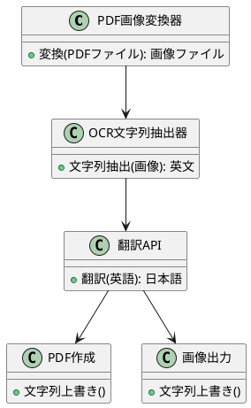

# システム構成図

```plantuml
@startuml

class "PDF画像変換器" as pdf_to_image{
    + 変換(PDFファイル): 画像ファイル
}

class "OCR文字列抽出器" as ocr{
    + 文字列抽出(画像): 英文
}

pdf_to_image --> ocr


class "翻訳API" as translator{
    + 翻訳(英語): 日本語
}

ocr --> translator

class "PDF作成" as output_pdf{
    + 文字列上書き()
}

translator --> output_pdf

class "画像出力" as output_image{
    + 文字列上書き()
}

translator --> output_image

@enduml
```